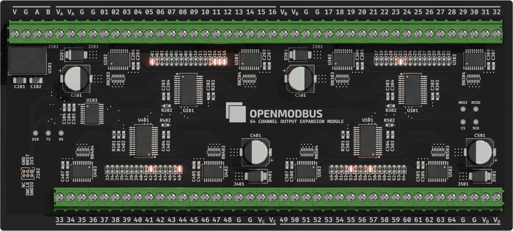
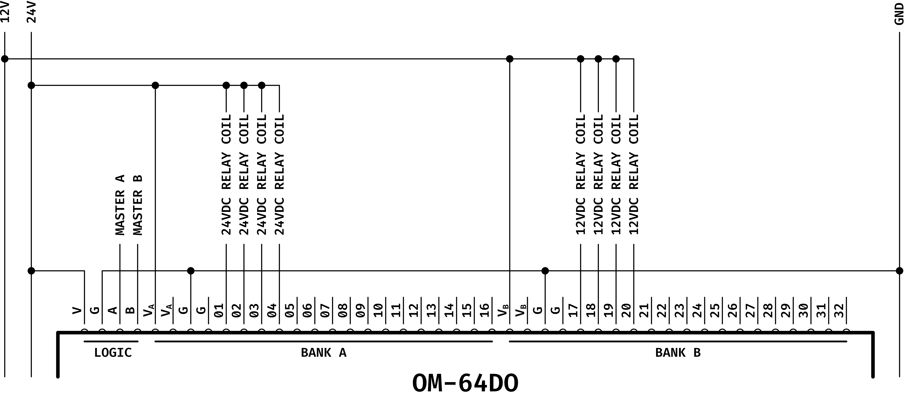

# Open Modbus OM-64DO




A compact industrial-grade **64-channel Modbus RTU output module** featuring low-side drivers, per-channel LEDs, wide input voltage, DIN-rail support, and full configuration via Modbus holding registers. Designed for automation, distributed I/O, and custom control applications.

**🔔 This project participates in PCBWay 8th Project Design Contest**

If you like what we do, please make sure to vote and drop a like: [https://www.pcbway.com/project/shareproject/Open_Modbus_OM_64DO_ae9ad184.html](https://www.pcbway.com/project/shareproject/Open_Modbus_OM_64DO_ae9ad184.html).

## 1. Product Overview

The **Open Modbus OM-64DO** is a 64-channel low-side output expansion module intended for industrial automation, machine control, and distributed I/O networks using **Modbus RTU** over RS-485.  
It switches DC loads such as solenoids, relays, indicator lamps, locks, and alarms up to **48 VDC**.

The module combines an **STM32G031** microcontroller, four **MCP23S17 SPI expanders**, and eight **TBD62083 Darlington driver arrays**.  
This architecture enables reliable, flexible, and scalable output control with built-in protection and per-channel LED indication.

### 📦 Hardware Files

The full schematic, PCB layout, and BOM are available at:

- Schematic → [https://github.com/OpenModbus/OM-64DO/blob/main/assets/schematics.pdf](https://github.com/OpenModbus/OM-64DO/blob/main/assets/schematics.pdf)
- PCB Design → [https://github.com/OpenModbus/OM-64DO/blob/main/assets/board_design.pdf](https://github.com/OpenModbus/OM-64DO/blob/main/assets/board_design.pdf)
- BOM → [https://github.com/OpenModbus/OM-64DO/blob/main/production/OM-64DO.csv](https://github.com/OpenModbus/OM-64DO/blob/main/production/OM-64DO.csv)

## 2. Key Features

- 64 open-collector low-side outputs  
- Up to **500 mA per output**, **2 A max** per driver package  
- **5–48 VDC** recommended load voltage (50 V absolute maximum)  
- Wide supply input: **7–28 VDC**  
- RS-485 Modbus RTU communication (THVD1450 transceiver)  
- Fully configurable serial parameters  
- Per-channel LED indicators  
- Screw terminals (Phoenix PT 1,5/..-H compatible)  
- DIN-rail mount using **UM72S profile**  
- Compact PCB (160 × 72 mm)

## 3. Applications

Ideal for:

- PLC expansion  
- Building automation  
- Access control  
- Alarm and signaling systems  
- Relay switching  
- Industrial prototyping  

## 4. Hardware Architecture

### Microcontroller  

The STM32G031F8P6 MCU handles Modbus RTU processing, configuration storage, SPI communication, and output refresh logic.

### I/O Expanders  

Four MCP23S17 SPI-based expanders provide the 64 output control signals in groups of 16.

### Output Drivers  

The TBD62083 Darlington arrays switch the actual loads.  
Their key characteristics include:

- 8 channels per IC  
- 500 mA per channel  
- 2 A total per IC  
- Integrated flyback diodes  
- LED indication per channel  

### RS-485 Communication  

A robust THVD1450 transceiver provides differential RS-485 communication with:

- Fail-safe features  
- High ESD immunity  
- Suitable for long cable runs  

### Power  

The board accepts **7–28 VDC** and includes a high-efficiency **R-78E3.3-1.0** regulator for its 3.3 V logic domain.

## 5. Electrical Specifications

### Supply  

- **7–28 VDC** input  
- Internal regulated **3.3 V logic**  
- Low power MCU operation  

### Outputs  

- 64 open-collector low-side channels  
- 5–48 VDC recommended load  
- 50 VDC absolute maximum  
- 500 mA max per output  
- 2 A max per driver IC  
- Built-in flyback protection  
- LED indicator on each output  

### Communication  

- RS-485, 2-wire  
- Modbus RTU protocol  
- Default settings: **9600 baud, 8N1, address 1**  
- All communication parameters can be reconfigured via holding registers  

## 6. Mechanical Information

- PCB: **160 × 72 mm**  
- DIN-rail enclosure compatibility: **UM72S profile**  
- PT 1,5 series screw terminals  
- Mounting suitable for industrial control cabinets  

## 7. Functional Overview

Each output activates when its Modbus coil value is **1**, causing the driver to sink current to ground.  
When the coil value is **0**, the channel turns off, leaving the load unpowered.

A dedicated LED mirrors the state of each output channel.

## 8. Modbus Interface

### Supported Function Codes

- *0x01* — Read Coils  
- *0x05* — Write Single Coil  
- *0x0F* — Write Multiple Coils  
- *0x03* — Read Holding Registers  
- *0x06* — Write Single Register  
- *0x10* — Write Multiple Registers  

### Coils (Outputs 1–64)

Coils map directly to output channels.  
Addressing begins at **0x00**.

| Coil Address (Hex) | Function     |
|--------------------|--------------|
| 0  (**0x00**)      | OUTPUT 1     |
| 1  (**0x01**)      | OUTPUT 2     |
| 2  (**0x02**)      | OUTPUT 3     |
| 3  (**0x03**)      | OUTPUT 4     |
| 4  (**0x04**)      | OUTPUT 5     |
| …                  | …            |
| 63 (**0x3F**)      | OUTPUT 64    |

### Holding Registers

Configuration registers start at **0x00** and are stored in non-volatile memory.

| Register Address (Hex) | Name           | Description                                                                                      | Allowed Values                                         | Default |
|------------------------|----------------|--------------------------------------------------------------------------------------------------|---------------------------------------------------------|---------|
| 0 (**0x00**)           | Slave Address  | Modbus device ID                                                                                 | 1–247                                                   | 1       |
| 1 (**0x01**)           | Baud Rate Code | Serial speed selector: **0=1200**, **1=2400**, **2=4800**, **3=9600**, **4=19200**, **5=38400**, **6=57600**, **7=115200** | 0–7                                                     | 3       |
| 2 (**0x02**)           | Parity         | Communication parity                                                                             | 0=None, 1=Even, 2=Odd                                   | 0       |
| 3 (**0x03**)           | Data Bits      | Serial data width                                                                                | 5–9 (typ. 8)                                            | 8       |
| 4 (**0x04**)           | Stop Bits      | Serial stop bits                                                                                 | 1–2                                                     | 1       |

### Example Modbus Commands

Below are typical Modbus RTU frames for controlling and configuring the OM-64DO.

#### Turn ON Output 1  

Function: Write Single Coil (0x05)  
Coil address: `0x0000`  
Value: ON → `0xFF00`  
**Frame:** `01 05 00 00 FF 00 8C 3A`

#### Turn ON Outputs 5–12  

Function: Write Multiple Coils (0x0F)  
Start address: `0x0004`  
Quantity: `0x0008` (8 coils)  
Data: `FF` (all eight bits ON)  
**Frame:** `01 0F 00 04 00 08 01 FF 4F 15`

#### Turn ON All Outputs (1–64)

Function: Write Multiple Coils (0x0F)  
Start address: `0x0000`  
Quantity: `0x0040` (64 coils)  
Data: `FF FF FF FF FF FF FF FF`  
**Frame:** `01 0F 00 00 00 40 08 FF FF FF FF FF FF FF FF AA 20`

#### Turn OFF All Outputs

Function: Write Multiple Coils (0x0F)  
Start address: `0x0000`  
Quantity: `0x0040`  
Data: `00 00 00 00 00 00 00 00`  
**Frame:** `01 0F 00 00 00 40 08 00 00 00 00 00 00 00 00 EB A4`

#### Read All Outputs

Function: Read Coils (0x01)  
Start address: `0x0000`  
Quantity: `0x0040`  
**Frame:** `01 01 00 00 00 40 3D FA`

#### Set Device Address

Function: Write Single Register (0x06)  
Register: `0x0000` (Slave Address)  
Value: `0x0005`  
**Frame:** `01 06 00 00 00 05 49 C9`

#### Set Baud Rate

Function: Write Single Register (0x06)  
Register: `0x0001` (Baud Rate Code)  
Value: `0x0007` → 115200 baud  
**Frame:** `01 06 00 01 00 07 99 C8`

## 9. Wiring  

The **OM-64DO** uses low-side (open-collector) switching.
That means the module connects the load to ground when ON, and the load must be powered from your external power supply.

The 64 outputs are grouped into four banks of 16 (Bank A–D).
This allows one board to drive devices powered from different voltages simultaneously.

**Examples**:

- Bank A → 12 V devices
- Bank B → 24 V relays
- Bank C → 48 V solenoids
- Bank D → 5 V indicators

### Low-Side Output Principle

Each output contains a protected Darlington transistor that sinks current:

```text
Load +V  ─────── Load ─────── OUTx (SINK)
                                    │
                                    └── GND (OM-64DO)
```

### Recommended Wiring Steps

- Connect the load voltage (5–48 VDC) to the Vx terminal of the bank.
- Connect the output pin (OUTx) to the negative side of the load.
- Tie power supply GND to OM-64DO GND.
- Ensure the supply can support the total current of that bank.

**⚠️ Important Grounding Requirement**:
All load power supplies must share **a common ground** with the OM-64DO.
This is required for the low-side drivers and internal logic to reference the same electrical 0 V.

### Wiring Example

The example below shows how to drive 24 V and 12 V relays at the same time using separate banks.

- Bank A (VA) → 24 V relays
- Bank B (VB) → 12 V relays
- Both supplies share a common ground
- Loads return their negative side to the selected OUTx channel

<picture>
  <source media="(prefers-color-scheme: dark)" srcset="./assets/wiring_example_dark.png">
  
</picture>

This wiring approach can be extended to all four banks, each with its own voltage.

## 10. Safety Notes

- Do not exceed **50 VDC** load voltage  
- Ensure load currents stay within limits  
- For inductive loads, external suppression can further improve reliability  
- Maintain proper RS-485 termination and shielding  

## 11. Contact & Support  

For questions, feedback, or technical assistance regarding the Open Modbus OM-64DO, the following support channels are available:

### 📧 Email Support

For general inquiries, firmware questions, or troubleshooting:
[contact@sszczep.dev](mailto:contact@sszczep.dev)

### 🛠 GitHub Repository

Issue tracker, source code, hardware design files, and community contributions:
[https://github.com/OpenModbus/OM-64DO](https://github.com/OpenModbus/OM-64DO)

### 💬 Open Modbus Discussions

Share projects, ask for help, or suggest features:
[https://github.com/orgs/OpenModbus/discussions](https://github.com/orgs/OpenModbus/discussions)

### 📝 Bug Reports & Feature Requests

Submit issues directly via GitHub Issues:
[https://github.com/OpenModbus/OM-64DO/issues](https://github.com/OpenModbus/OM-64DO/issues)
